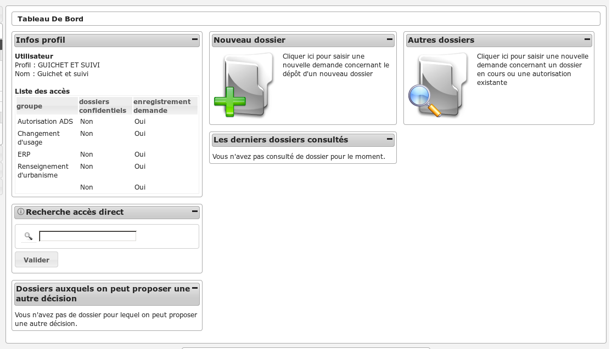

################
GUICHET ET SUIVI
################

Description
===========

Fonctionnalités disponibles
===========================

Tableau de bord
---------------

Widget *Infos profil*
#####################

- Visualiser les informations du profil de l'utilisateur connecté

Widget *Recherche accès direct*
###############################

- Rechercher un dossier d'instruction par son identifiant

Widget *Nouveau dossier*
########################

Widget *Autres dossiers*
########################

Widget *Dossiers auxquels on peut proposer une autre décision*
##############################################################

Widget *Les derniers dossiers consultés*
########################################

- Visualiser la liste des derniers dossiers consultés

Menu
----

.. image:: menu_guichetsuivi.png

Rubrique *Autorisation*
-----------------------

Actions identiques à celles du profil instructeur (cf :ref:`Rubrique autorisation<profil_instructeur_rubrique_autorisation>`)

Rubrique *Guichet Unique*
-------------------------

Actions identiques à celles du profil guichet unique (cf :ref:`Rubrique guichet unique<profil_guichet_unique_rubrique_guichet_unique>`)

Rubrique *Instruction*
----------------------

Actions identiques à celles du profil guichet unique (cf :ref:`Rubrique instruction<profil_guichet_unique_rubrique_instruction>`)

Rubrique *Suivi*
----------------

Actions identiques à celles du profil cellule suivi (cf :ref:`Rubrique suivi<profil_suivi_rubrique_suivi>`)

Rubrique *Export / Import*
--------------------------

Actions identiques à celles du profil guichet unique (cf :ref:`Rubrique export / import<profil_guichet_unique_rubrique_export_import>`)
